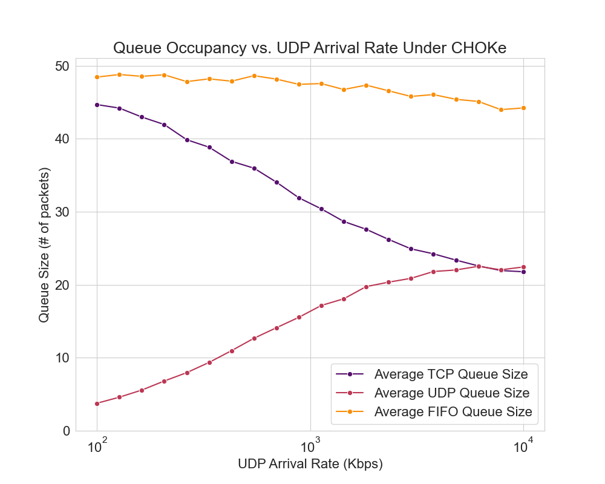

# Overview

This repo contains a fork of ns-2 (a widely used network simulator) that contains an implementation of CHOKe per its defining paper, for the purposes of replicating a key result (Figure 6) from that paper.

## Installation Instructions

You have a choice in installation process. You can either begin from the NS-2 all-in-one distribution, or you can install the minimum prerequisites (TCL and OTCL) of the appropriate versions and use those.

### All-in-one installation

1. Download and extract the NS-2 all-in-one distribution from [here](https://sourceforge.net/projects/nsnam/files/allinone/ns-allinone-2.35/ns-allinone-2.35.tar.gz/download).
2. Copy this repository's contents into the `ns-2.35` subdirectory of the above, overwriting the previous directory.
3. Double check the versions of all packages (you should see the following in the `install` script at the top-level of the all-in-one distribution folder).

```
TCLVER=8.5.10
TKVER=8.5.10
OTCLVER=1.14
TCLCLVER=1.20
NSVER=2.35
NAMVER=1.15
XGRAPHVER=12.2
ZLIBVER=1.2.3
DEI80211MRVER=1.1.4
```

4. Run the `install` script (if on macOS, you'll likely need to `make` each subdirectory one at a time).
5. If you are on macOS, note that you will need to modify the auto-generated `Makefile`s in order to make it compile and link correctly (see section "macOS Makefile modifications" below).

### Targeted installation

1. Ensure you have TCL v8.5.10 and OTCL v1.14 installed.
2. Run `./configure --with-tcl=$TCL_INSTALL_PREFIX --with-tk=/Users/sumer/Downloads/ns-allinone-2.35=$TK_INSTALL_PREFIX --with-tcl-ver=8.5 --with-otcl=$OTCL_PACKAGE_PATH --with-tclcl=$TCLCL_PACKAGE_PATH  --prefix=/tmp/ns-prefix`. Set environment variables `$TCL_INSTALL_PREFIX` and `$TK_INSTALL_PREFIX` to be the installation _prefix_ (not the package path) of TCL and TK 8.5. If you installed in prefix `/`, for example, the `configure` script would expect that `/bin/tclsh8.5` would exist. Set `$OTCL_PACKAGE_PATH` and `$$TCLCL_PACKAGE_PATH` to the package paths of OTCL and TCLCL respectively (make sure that `configure` / `make` have already been run inside their package directories, so the expected libraries are compiled and present).
3. If you're on macOS, see section "macOS Makefile modifications" below to modify the auto-generated `Makefile`s correctly.
4. Run `make -j 4` followed by `make install`.

### macOS Makefile modifications
If you are on macOS, you will need to modify auto-generated `Makefile`s (both at the top-level, **and in every package in `indep-utils`**) in a few different ways to ensure that linking and compiling work correctly. We have provided a script to make all the modifications for you. Simply run:
```
$ ./update-macos-makefile.sh
```

after the `./configure <...>` command runs. Note that this is not an idempotent operation, so do not run this script more than once. You will need to rerun it every time the `Makefile`s are regenerated (i.e. by `./configure`).


## Usage Instructions
Once the installation is complete, a file called `ns` will be written to your installation prefix as well as the package directory. You should be able to run `./ns` and see:
```
%
```
which indicates a successful installation. Hit Ctrl-C to exit.


Now, run the following:
```
$ cd replication
$ python sweep.py
```

which will generate the TCL network toplogies and run `ns2` automatically as appropriate (note that it uses binary path `../ns` for ns-2). The final figure will be written to `sweep.png` and should look as follows:


